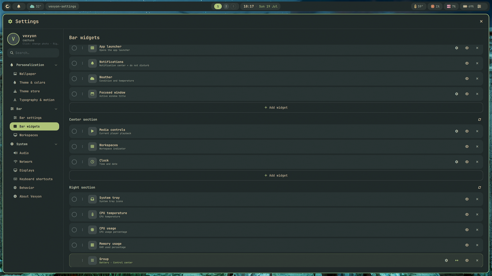
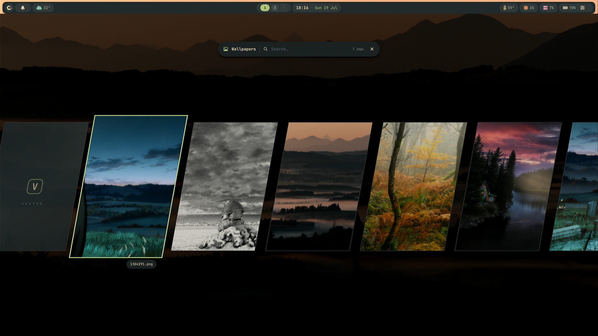
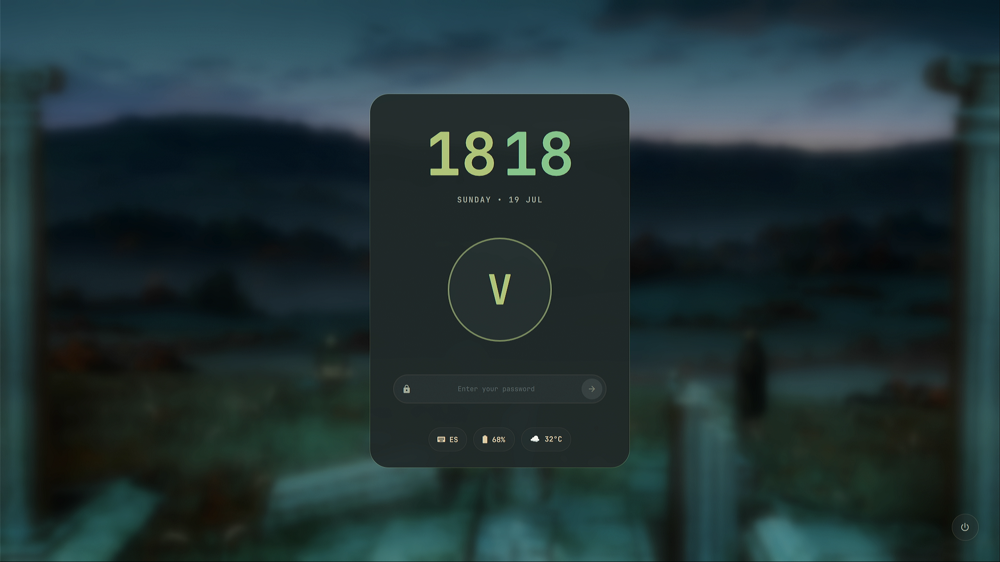

<div align="center">

# Vexyon Shell

**A from-scratch Wayland desktop shell for Hyprland — lightweight, fully themeable, and 100% configurable from the UI. No dotfiles required.**

[](https://archlinux.org)
[](https://cachyos.org)
[](https://hypr.land)
[](https://quickshell.org)
[](https://wayland.freedesktop.org)

<br>


</div>

Vexyon is a complete desktop shell built from scratch in QML on [Quickshell](https://quickshell.org): bar, launcher, panels, settings, lock screen, OSD and even the login greeter are one cohesive, themed system — not a collection of separate tools. Everything is configured from the built-in Settings app; you never have to touch a config file.

---

## ✨ Showcase

<div align="center">
<table>
  <tr>
    <td align="center" width="50%">
      <br>
      <sub><b>Dashboard</b> — clock, calendar and weather with hourly forecast</sub>
    </td>
    <td align="center" width="50%">
      <br>
      <sub><b>Settings</b> — add, remove and reorder bar widgets from the UI</sub>
    </td>
  </tr>
  <tr>
    <td align="center" width="50%">
      <br>
      <sub><b>Wallpaper picker</b> — browse and search your wallpapers</sub>
    </td>
    <td align="center" width="50%">
      <br>
      <sub><b>Lock screen</b> — blurred wallpaper, themed clock and status pills</sub>
    </td>
  </tr>
</table>
</div>

---

## Features

- **100% configurable from the UI** — the Settings app covers wallpaper, themes, typography & motion, bar layout, keybinds, audio, network, displays and behavior. Changes apply live: a small bridge regenerates the Hyprland config and reloads it for you. No dotfile editing, ever.
- **Fully themeable** — 6 bundled themes (Catppuccin Mocha & Latte, Tokyo Night, Gruvbox Dark, AMOLED, Crimson Voltage) plus a theme store. The active theme drives the whole desktop: bar, panels, OSD, lock screen, greeter and even Hyprland window borders recolor instantly on switch.
- **Modular bar** — add, remove and reorder widgets per section: workspaces, clock, weather, media controls, focused window, system tray, CPU/RAM/temperature, battery, notifications and more.
- **Custom greetd greeter** — the login screen is part of the shell and stays in sync with your theme, language and keyboard layout.
- **Multimedia keys + themed OSD** — volume, brightness, mic mute and media keys work out of the box, with a clean bottom-center OSD that follows your theme. Event-driven (MPRIS and PipeWire handled in-process — no `playerctl`/`wpctl` spawning).
- **Dynamic iGPU pinning for hybrid laptops** — on iGPU + NVIDIA machines the session runs pinned to the iGPU; a udev hotplug handler re-decides on display hotplug, so plugging an external monitor wired to the dGPU works without reboot or re-login. No daemons, no polling.
- **Built-in everything** — app launcher, file manager, clipboard history, screenshot tool with region crop, notification center, quick settings, media / volume / network / battery / system-monitor panels, power menu and a keybind editor.
- **Lock screen with PAM auth** — blurred wallpaper backdrop, themed clock, avatar and status pills (keyboard layout, battery, weather).
- **i18n** — English and Spanish, switchable live from Settings (dates, weather and all UI strings included).
- **Lightweight by design** — event-driven services, timers that only run when their widget is on screen, minimal external dependencies.

## Requirements

- **Arch Linux** or **CachyOS** (Arch-based)
- **Hyprland** on Wayland

Vexyon is built to be installed on a **minimal base install** — the installer pulls in its own dependencies (Hyprland, Quickshell, greetd, etc.) via `pacman`.

## Installation

```bash
sudo pacman -S git
git clone https://github.com/vexyon/vexyon_shell.git
cd vexyon_shell
sudo chmod +x install.sh
./install.sh
sudo reboot
```

> **Note:** run `install.sh` as your normal user, **not** with sudo — it will ask for elevation only where needed. Only the `chmod` line uses sudo.

After the reboot, pick the **Vexyon** session at the greeter and you're in.

---

<div align="center">

## Support & Socials

Follow the project, or help keep development going — every bit of support is genuinely appreciated 💚

<br>

[](https://www.tiktok.com/@vexyon.dev?is_from_webapp=1&sender_device=pc)
[](https://www.instagram.com/vexyon.dev/)
[](https://ko-fi.com/vexyon)

<sub>If Vexyon makes your desktop nicer, a coffee on Ko-fi is an optional but lovely way to support its development ☕</sub>

</div>
