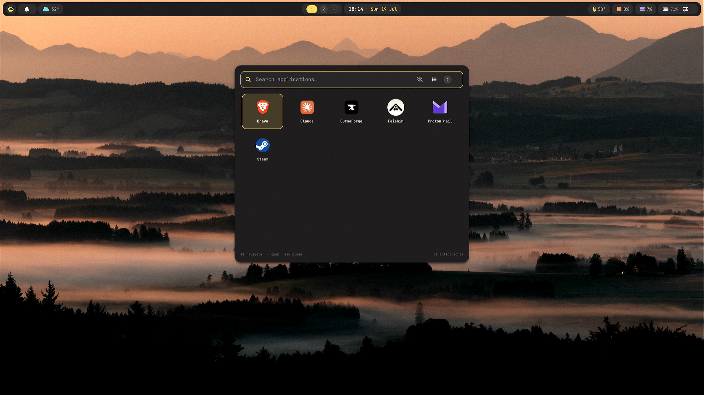
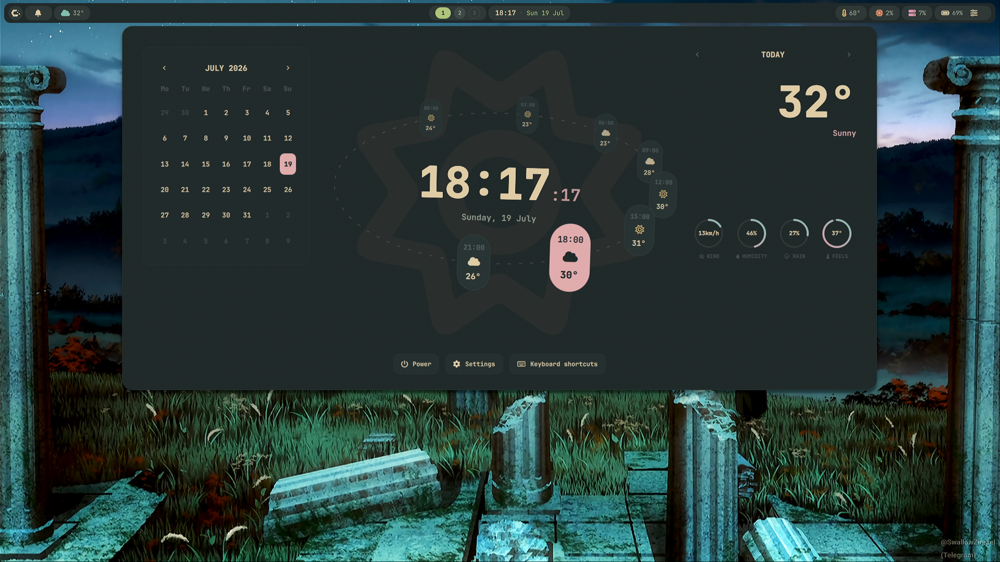
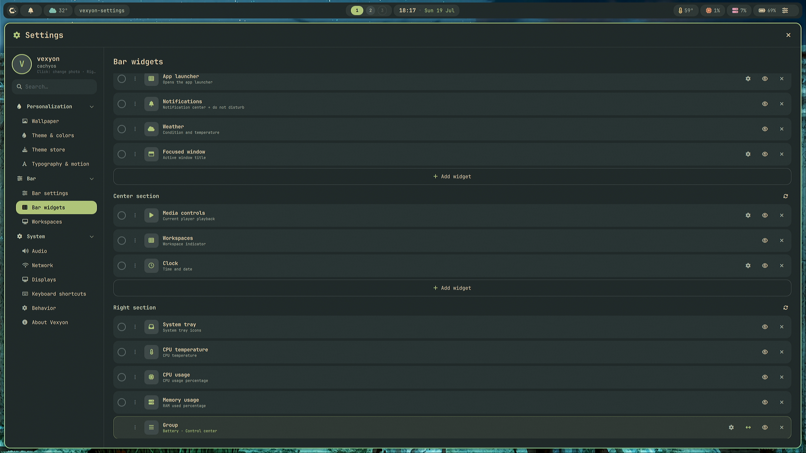
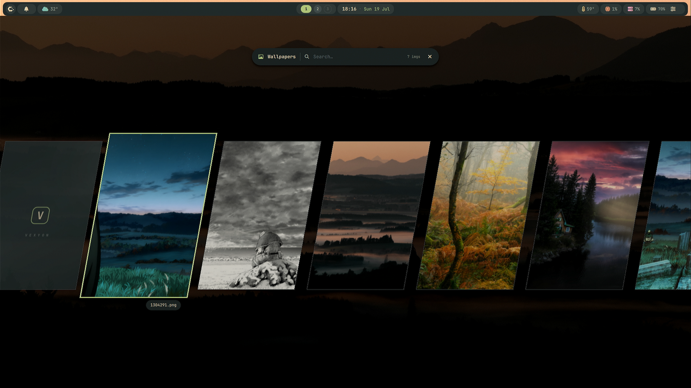
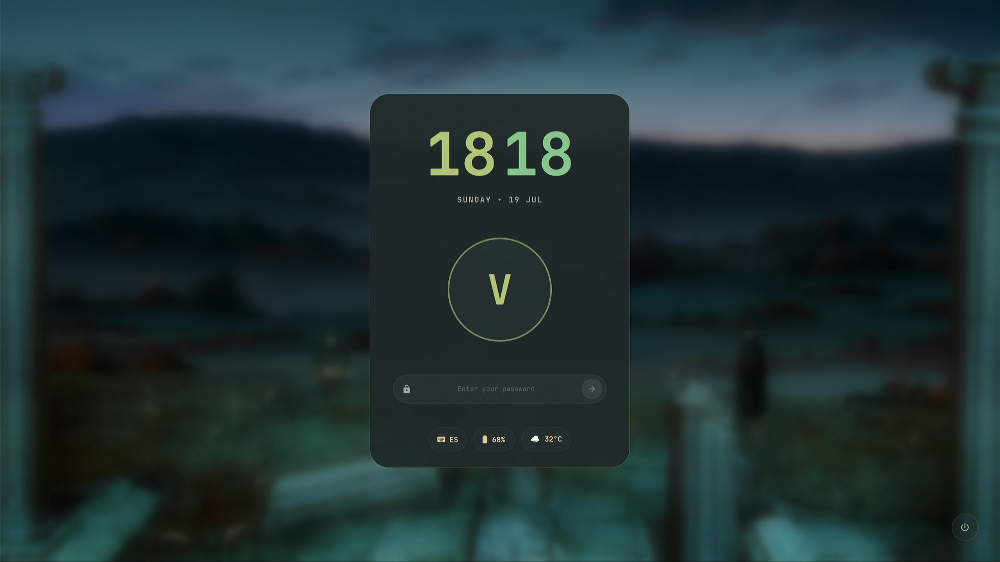

<div align="center">

# Vexyon Shell

**A from-scratch Wayland desktop shell for Hyprland — lightweight, fully themeable, and 100% configurable from the UI. No dotfiles required.**

[](CHANGELOG.md)
[](https://archlinux.org)
[](https://cachyos.org)
[](https://hypr.land)
[](https://quickshell.org)
[](https://wayland.freedesktop.org)

<br>



</div>

Vexyon is a complete desktop shell built from scratch in QML on [Quickshell](https://quickshell.org): bar, launcher, panels, settings, lock screen, OSD and even the login greeter are one cohesive, themed system — not a collection of separate tools. Everything is configured from the built-in Settings app; you never have to touch a config file.

---

## ✨ Showcase

<div align="center">
<table>
  <tr>
    <td align="center" width="50%">
      <br>
      <sub><b>Dashboard</b> — clock, calendar and weather with hourly forecast</sub>
    </td>
    <td align="center" width="50%">
      <br>
      <sub><b>Settings</b> — add, remove and reorder bar widgets from the UI</sub>
    </td>
  </tr>
  <tr>
    <td align="center" width="50%">
      <br>
      <sub><b>Wallpaper picker</b> — browse and search your wallpapers</sub>
    </td>
    <td align="center" width="50%">
      <br>
      <sub><b>Lock screen</b> — blurred wallpaper, themed clock and status pills</sub>
    </td>
  </tr>
</table>
</div>

---

## Features

- **100% configurable from the UI** — the Settings app covers wallpaper, themes, typography & motion, bar layout, keybinds, audio, network, displays and behavior. Changes apply live: a small bridge regenerates the Hyprland config and reloads it for you. No dotfile editing, ever.
- **Fully themeable** — 26 bundled themes (among them Catppuccin, Tokyo Night, Gruvbox, Rosé Pine, Kanagawa, Solarized, AMOLED, Crimson Voltage and the rest of Omarchy's set: Ethereal, Flexoki Light, Hackerman, Last Horizon, Lumon, Lupine, Matte Black, Miasma, Osaka Jade, Retro 82, Ristretto, Solitude, Vantablack, White) plus a theme store (which also has Nord and Everforest). The active theme drives the whole desktop: bar, panels, OSD, lock screen, greeter and even Hyprland window borders recolor instantly on switch.
- **Modular bar** — add, remove and reorder widgets per section: workspaces, clock, weather, media controls, focused window, system tray, CPU/RAM/temperature, battery, notifications and more.
- **Custom greetd greeter** — the login screen is part of the shell and stays in sync with your theme, language and keyboard layout.
- **Multimedia keys + themed OSD** — volume, brightness, mic mute and media keys work out of the box, with a clean bottom-center OSD that follows your theme. Event-driven (MPRIS and PipeWire handled in-process — no `playerctl`/`wpctl` spawning).
- **Dynamic iGPU pinning for hybrid laptops** — on iGPU + NVIDIA machines the session runs pinned to the iGPU; a udev hotplug handler re-decides on display hotplug, so plugging an external monitor wired to the dGPU works without reboot or re-login. No daemons, no polling.
- **Built-in everything** — app launcher, file manager, clipboard history, screenshot tool with region crop, notification center, quick settings, media / volume / network / battery / system-monitor panels, power menu and a keybind editor.
- **Lock screen with PAM auth** — blurred wallpaper backdrop, themed clock, avatar and status pills (keyboard layout, battery, weather).
- **i18n** — English and Spanish, switchable live from Settings (dates, weather and all UI strings included).
- **Virtual machines** — a built-in VM manager (Super+V) on libvirt/QEMU: create, start, stop, snapshots, shared folders, TPM for Windows 11, OVA import/export, NAT/host-only/internal networks and a graphical display window (also on the dedicated GPU of hybrid laptops).
- **Screen recording** — record a monitor or a region with system sound or the microphone (Super+Shift+V).
- **Optional modules, switched from Settings** — virtual machines, Bluetooth and screen recording are installed and on by default; turn off what you don't use in **Settings → Modules** and its background services stop starting. [More below](#optional-modules).
- **Lightweight by design** — event-driven services, timers that only run when their widget is on screen, minimal external dependencies.

## Requirements

- **Arch Linux** or **CachyOS** (Arch-based)
- **Hyprland** on Wayland

Vexyon is built to be installed on a **minimal base install** — the installer pulls in its own dependencies (Hyprland, Quickshell, greetd, etc.) via `pacman`.

For virtual machines the CPU's hardware virtualization (Intel VT-x or AMD-V/SVM) has to be turned on in the firmware (BIOS/UEFI) settings. That is the one thing no installer can do; Settings → Virtualization tells you if it is off.

## Installation

```bash
sudo pacman -S git
git clone https://github.com/vexyon/vexyon_shell.git
cd vexyon_shell
sudo chmod +x install.sh
./install.sh
sudo reboot
```

> **Note:** run `install.sh` as your normal user, **not** with sudo — it will ask for elevation only where needed. Only the `chmod` line uses sudo.

After the reboot, pick the **Vexyon** session at the greeter and you're in.

### What the installer sets up

Everything every feature needs — nothing has to be installed, enabled or edited by hand afterwards:

- **The desktop:** Hyprland, Quickshell, the greetd login screen, portals, polkit agent, PipeWire, fonts, cursors and the rest of the shell's dependencies.
- **Virtual machines:** `libvirt`, `qemu-desktop` (kept as is if you already have another QEMU), `virt-viewer`, `dnsmasq`, `swtpm`, `virtiofsd` and `edk2-ovmf`; the libvirt daemon (started at boot, then on demand), your user in the `libvirt` group, libvirt's default NAT network, and — when Docker or ufw is installed — libvirt's iptables firewall backend so VMs keep their network.
- **Bluetooth:** `bluez` and its service (it only runs when an adapter is present).
- **Screen recording:** `wf-recorder`.
- **The rest:** `hyprpicker` (color picker), `pacman-contrib` (update counter), `libpulse` and `psmisc` (audio and privacy widgets), NetworkManager enabled when nothing else manages the network.
- **Settings → Modules:** a small root-owned helper (`/usr/local/lib/vexyon/vexyon-modules`), its polkit action, a boot unit (`vexyon-modules.service`) and one systemd drop-in per module service — see [Optional modules](#optional-modules).

Already-configured things are respected: a masked service stays masked, an existing libvirt setup with modular daemons is left alone, a `firewall_backend` you wrote is not touched, and NetworkManager is not enabled if another network manager is active.

### Updating

Pull and run the installer again. It is idempotent: it installs only what is missing, keeps your `shell.json` and every choice made in Settings (modules included), and never restarts your session.

```bash
cd vexyon_shell
git pull
./install.sh
```

## Optional modules

**Settings → Modules** lists the parts of Vexyon you can turn off. All of them are installed and **on** by default.

| Module | When it is off | Applies |
|---|---|---|
| **Virtual machines** | The VM manager and its bar widget are gone, and libvirt's services (`libvirtd`, `virtlogd`, `virtlockd`, `libvirt-guests` and their sockets) no longer start. | at the next restart |
| **Bluetooth** | The Bluetooth controls are gone and `bluetooth.service` no longer starts, so Bluetooth devices do not connect. | at the next restart |
| **Screen recording** | The recorder, its shortcut target, launcher entry and bar indicator are gone. It has no background service. | immediately |

- **Turning a module off never removes anything.** Packages stay installed; VMs, disks, networks, snapshots and Bluetooth pairings are kept. Turning it back on needs no download and no command — just the restart.
- **Nothing is stopped mid-session.** A module with services changes at the next boot, so a running VM or a connected headset is never pulled away. The card says "On until the next restart" while a change is pending.
- **System changes need your password once.** The switch asks through the normal polkit dialog; the only thing it can do is record that module choice.
- **Shared services are respected.** If other software you installed uses the same service — virt-manager or cockpit-machines for libvirt, GNOME, Plasma or Blueman for Bluetooth — that service keeps starting even with the module off; only Vexyon's part is hidden. The card names the software.
- **Always on:** the bar, launcher, panels, notifications, lock and login screens, wallpaper, clipboard history, night light, audio, networking and power. Tools like the calculator, screenshots, the color picker and the file manager run only while you use them.

---

<div align="center">

## Support & Socials

Follow the project, or help keep development going — every bit of support is genuinely appreciated 💚

<br>

[](https://www.tiktok.com/@vexyon.dev?is_from_webapp=1&sender_device=pc)
[](https://www.instagram.com/vexyon.dev/)
[](https://ko-fi.com/vexyon)

<sub>If Vexyon makes your desktop nicer, a coffee on Ko-fi is an optional but lovely way to support its development ☕</sub>

</div>
